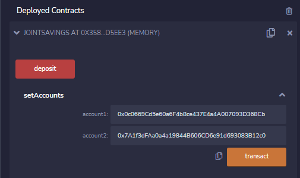
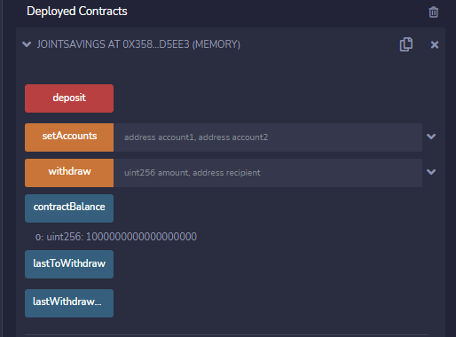
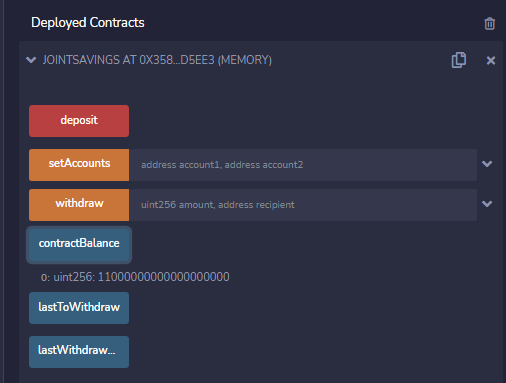
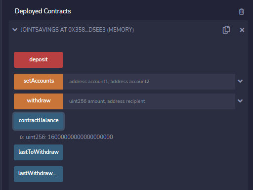
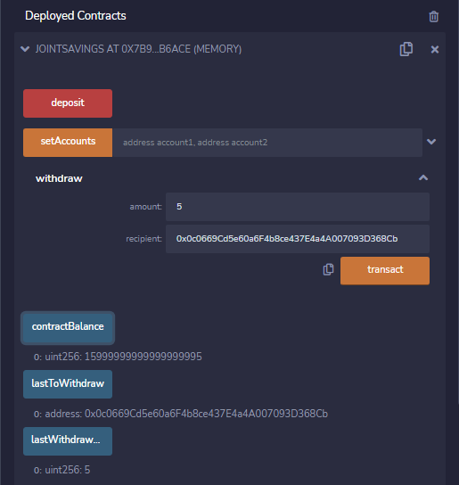
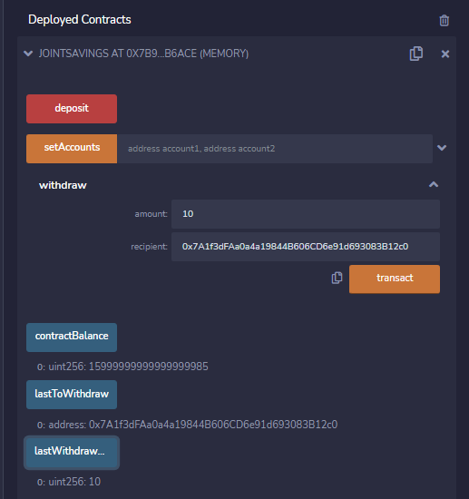

# Smart Contract Joint Savings Account

###

## Technologies

The application uses the following technologies:

- [Solidity v. 0.5.0](https://docs.soliditylang.org/en/v0.5.0/)
- [Remix IDE](https://remix.ethereum.org/)

## Usage

Navigate to the Remix IDE and open the **JointSavings.sol** file and deploy.

Use the functions to interact with the application:
1) Set the accounts in the `setAccounts` function box, as shown in the image below:

2) To use the `deposit` function, enter an amount and select a type. The below image illustrate three deposits and the resulting account balance using the `deposit` function:

3) To use the `withdraw` function, enter the amount of ether and the recipient address as shown in the below two examples:

4) Note in the above images, the `contractBalance`, `lastToWithdraw`, `lastWithdraw` functions should be used to view the details and the running balance of transactions.

